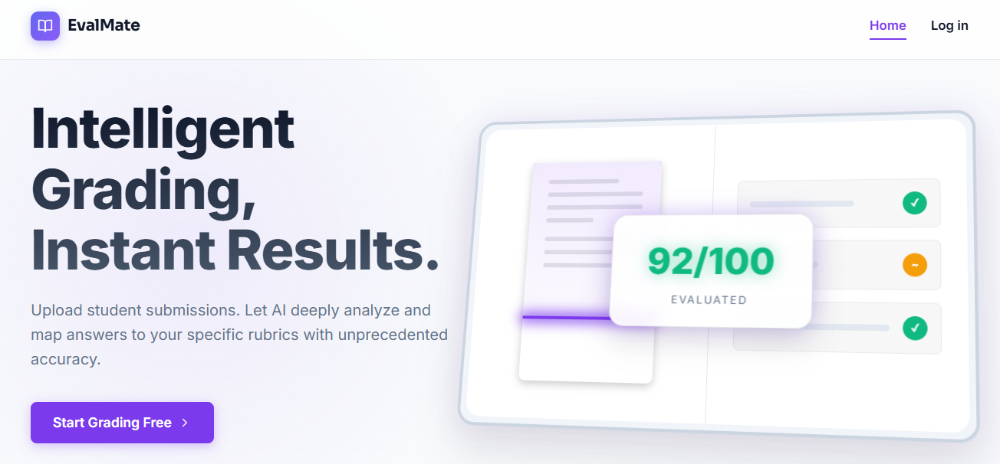
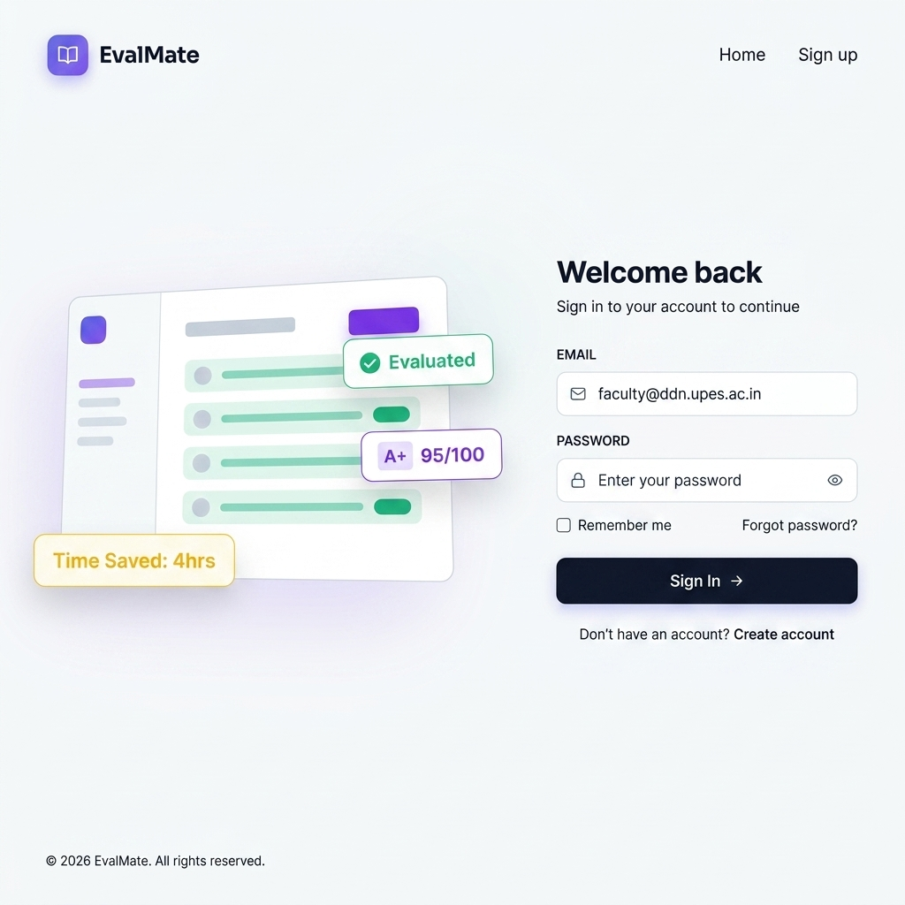
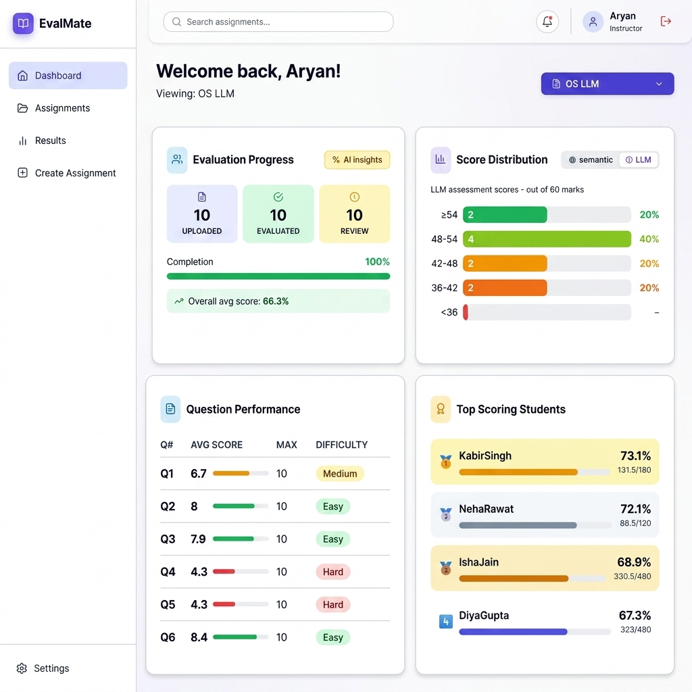
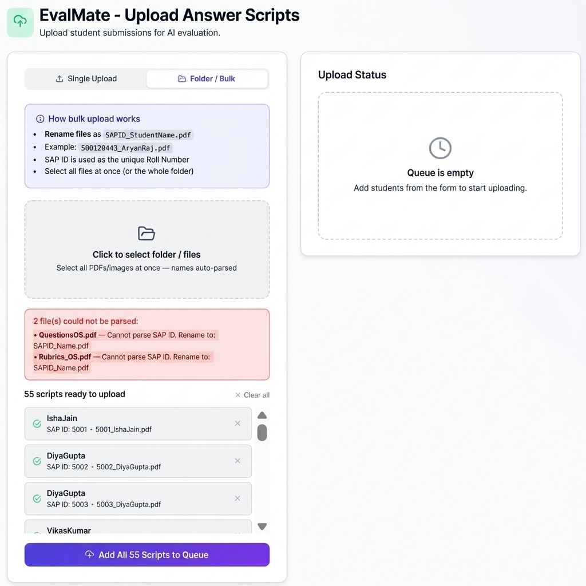
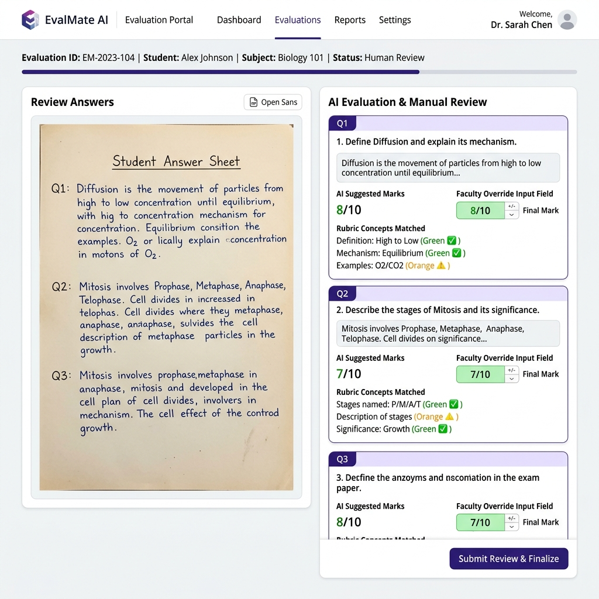
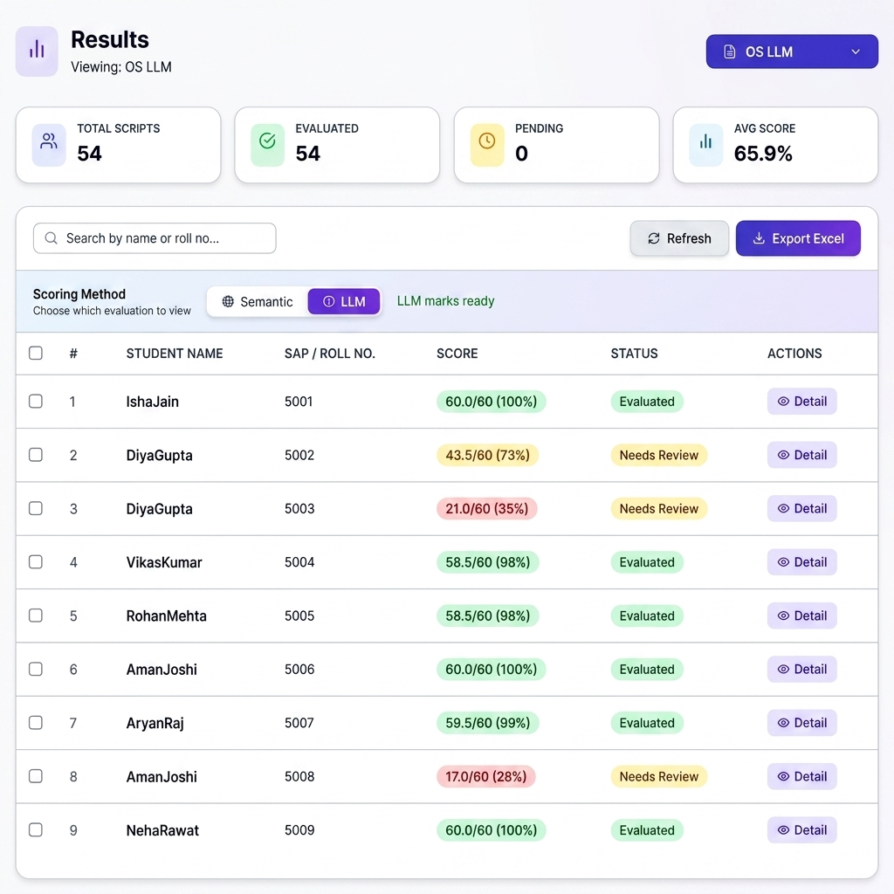
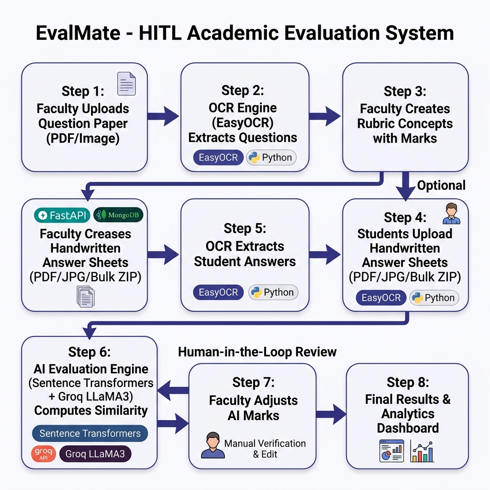

<div align="center">



# 🎓 EvalMate — AI-Assisted Academic Evaluation System

**Automate handwritten answer sheet evaluation with OCR, NLP, and Human-in-the-Loop review**

[](https://fastapi.tiangolo.com/)
[](https://reactjs.org/)
[](https://www.mongodb.com/)
[](https://python.org/)
[](LICENSE)

[Features](#-features) · [Demo Screenshots](#-demo-screenshots) · [Architecture](#-system-architecture) · [Installation](#-installation) · [Usage](#-usage) · [API Docs](#-api-documentation)

</div>

---

## 📌 Overview

**EvalMate** is a full-stack AI-powered web application designed to streamline and automate the academic evaluation process for faculty members. It uses **OCR** (Optical Character Recognition) to extract text from handwritten answer scripts, **NLP-based semantic similarity** to match student answers against faculty-defined rubrics, and a **Human-in-the-Loop (HITL)** review interface so faculty can validate or override AI-suggested marks.

> Built for real-world academic use — handles bulk uploads, supports SAP ID-based student identification, and exports results to Excel.

---

## ✨ Features

| Feature | Description |
|--------|-------------|
| 🔐 **Faculty Auth** | JWT-based secure signup/login with bcrypt password hashing |
| 📄 **Question Paper OCR** | Upload question paper as PDF/image; auto-extract questions & marks |
| 📝 **Rubric Builder** | Define concept-level rubrics with per-concept marks for each question |
| 📤 **Bulk Upload** | Upload student answer sheets individually, via ZIP, or folder; auto-parse SAP ID from filename |
| 🤖 **AI Evaluation** | Semantic similarity (Sentence Transformers) + Keyword matching + Groq LLaMA3 for open-ended questions |
| 👁️ **HITL Review** | Faculty reviews AI suggestions and overrides marks before finalizing |
| 📊 **Analytics Dashboard** | Score distribution, question performance, AI insights, top students |
| 📥 **Export Results** | Download evaluation results as Excel/CSV files |
| ⚡ **Groq Free API** | Uses Groq's free LLaMA3 API (14,400 req/day) for open-ended answer scoring |

---

## 🖼️ Demo Screenshots

### 🔑 Login Page


---

### 📊 Analytics Dashboard


---

### 📤 Upload Answer Scripts


---

### 👁️ Human-in-the-Loop Review


---

### 📈 Evaluation Results


---

## 🏗️ System Architecture



### Tech Stack

```
Frontend:  React 18 + Vite + React Router + Lucide Icons
Backend:   FastAPI (Python) + Motor (async MongoDB driver)
Database:  MongoDB (local or Atlas)
AI/ML:     EasyOCR · Sentence Transformers (all-MiniLM-L6-v2) · Groq LLaMA3 API
Security:  JWT (PyJWT) · Bcrypt (Passlib)
```

---

## 🚀 Installation

### Prerequisites

- Python 3.10+
- Node.js 18+
- MongoDB (local or Atlas URI)
- [Groq API Key](https://console.groq.com) *(free, no credit card)*
- Poppler (for PDF-to-image conversion)

---

### 1️⃣ Clone the Repository

```bash
git clone https://github.com/aryanraj71/EvalMate-Evaluation-System.git
cd EvalMate-Evaluation-System
```

---

### 2️⃣ Backend Setup

```bash
cd backend/app

# Create and activate virtual environment
python -m venv venv
venv\Scripts\activate        # Windows
# source venv/bin/activate   # Linux/Mac

# Install dependencies
pip install -r requirements.txt
```

#### Configure Environment Variables

Create a `.env` file in `backend/app/`:

```env
# MongoDB
MONGO_URL=mongodb://localhost:27017
DB_NAME=evalmate

# JWT
JWT_SECRET=your-super-secret-key-here
JWT_ALGORITHM=HS256
JWT_EXPIRATION_HOURS=168

# AI APIs (Groq is FREE - get key at https://console.groq.com)
GROQ_API_KEY=gsk_your_groq_api_key_here
GEMINI_API_KEY=your_gemini_key_here   # optional fallback
```

#### Start the Backend Server

```bash
uvicorn main:app --reload --port 8000
```

The API will be available at `http://localhost:8000`  
Interactive docs: `http://localhost:8000/docs`

---

### 3️⃣ Frontend Setup

```bash
cd frontend

# Install dependencies
npm install

# Start development server
npm run dev
```

The frontend will be available at `http://localhost:5173`

---

## 📖 Usage

### Step-by-Step Evaluation Workflow

```
1. Sign Up / Login        →  Faculty creates an account
2. Create Assignment      →  Set assignment name, subject, date, max marks
3. Upload Question Paper  →  PDF/image auto-scanned via OCR → questions extracted
4. Define Rubrics         →  Add concept-level rubric for each question with marks
5. Upload Answer Scripts  →  Students' handwritten sheets (individual or bulk ZIP)
                             Files named: <SAP_ID>_<StudentName>.pdf
6. Run AI Evaluation      →  System extracts answers via OCR, computes semantic scores
7. HITL Review            →  Faculty reviews AI marks, adjusts if needed, submits
8. View Results           →  Dashboard analytics + export to Excel
```

---

### 📁 Answer Sheet Naming Convention

For SAP ID auto-detection, name answer sheet files as:

```
500120443_AryanRaj.pdf
500120444_Priya Sharma.jpg
500120445_RahulGupta.pdf
```

---

## 🧠 AI Evaluation Engine

EvalMate uses a **3-layer hybrid scoring system**:

```
Layer 1: Semantic Similarity   (Sentence Transformers all-MiniLM-L6-v2)
          ↓ cosine similarity between student chunks and rubric concepts

Layer 2: Keyword Overlap Score (TF-inspired keyword matching with stemming)
          ↓ domain-term overlap after stopword removal

Layer 3: LLM Scoring           (Groq LLaMA3 — only for open/example questions)
          ↓ structured JSON output: {"score": 0.85, "reason": "..."}

Final Score = max(semantic, keyword, llm)   → fair benefit-of-doubt to students
```

Marks are standardized to **nearest 0.5** (e.g., 7.19 → 7.0, 7.34 → 7.5).

---

## 📡 API Documentation

Once the backend is running, visit:

```
http://localhost:8000/docs       # Swagger UI
http://localhost:8000/redoc      # ReDoc
```

### Key Endpoints

| Method | Endpoint | Description |
|--------|----------|-------------|
| `POST` | `/api/auth/signup` | Faculty registration |
| `POST` | `/api/auth/login` | Faculty login |
| `GET`  | `/api/assignments` | List all assignments |
| `POST` | `/api/assignments` | Create assignment |
| `POST` | `/api/assignments/{id}/upload-question` | Upload & OCR question paper |
| `POST` | `/api/assignments/{id}/upload-answers` | Upload student answer scripts |
| `POST` | `/api/assignments/{id}/evaluate` | Run AI evaluation |
| `GET`  | `/api/assignments/{id}/results` | Get evaluation results |
| `POST` | `/api/assignments/{id}/review/{student_id}` | Submit HITL review |
| `GET`  | `/api/dashboard/assignment/{id}` | Get analytics data |
| `GET`  | `/api/assignments/{id}/export` | Download Excel results |

---

## 📂 Project Structure

```
EvalMate-Evaluation-System/
├── backend/
│   └── app/
│       ├── main.py              # FastAPI app — all routes & AI logic
│       ├── models.py            # Pydantic models
│       ├── requirements.txt     # Python dependencies
│       ├── .env                 # Environment variables (not committed)
│       └── routes/              # Route handlers (auth, assignments, etc.)
│
├── frontend/
│   ├── src/
│   │   ├── App.jsx              # Root component & routing
│   │   ├── components/          # Navbar, Sidebar, Layout, Footer
│   │   ├── pages/               # All page components
│   │   │   ├── Login.jsx
│   │   │   ├── Dashboard.jsx
│   │   │   ├── Assignments.jsx
│   │   │   ├── CreateAssignment.jsx
│   │   │   ├── QuestionManagement.jsx
│   │   │   ├── RubricManagement.jsx
│   │   │   ├── UploadAnswers.jsx
│   │   │   ├── EvaluationResults.jsx
│   │   │   ├── ReviewAnswers.jsx
│   │   │   └── Results.jsx
│   │   └── services/
│   │       └── api.js           # Axios API client
│   ├── package.json
│   └── vite.config.js
│
├── docs/
│   └── images/                  # Project screenshots
│
└── README.md
```

---

## 🔧 Configuration Reference

| Variable | Default | Description |
|----------|---------|-------------|
| `MONGO_URL` | `mongodb://localhost:27017` | MongoDB connection string |
| `DB_NAME` | `evalmate` | Database name |
| `JWT_SECRET` | *(required)* | Secret key for JWT signing |
| `JWT_EXPIRATION_HOURS` | `168` | Token validity (7 days) |
| `GROQ_API_KEY` | *(optional)* | Free Groq API key for LLM scoring |
| `GEMINI_API_KEY` | *(optional)* | Gemini API key (fallback) |

---

## 🤝 Contributing

Contributions, issues, and feature requests are welcome!

1. Fork the repository
2. Create your feature branch: `git checkout -b feature/amazing-feature`
3. Commit your changes: `git commit -m 'Add amazing feature'`
4. Push to the branch: `git push origin feature/amazing-feature`
5. Open a Pull Request

---

## 📄 License

This project is licensed under the **MIT License** — see the [LICENSE](LICENSE) file for details.

---

